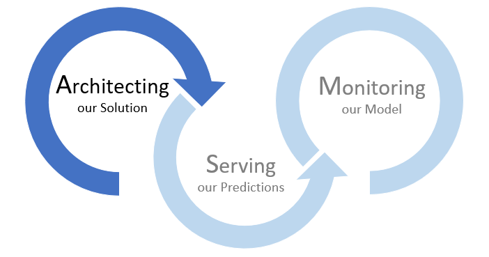
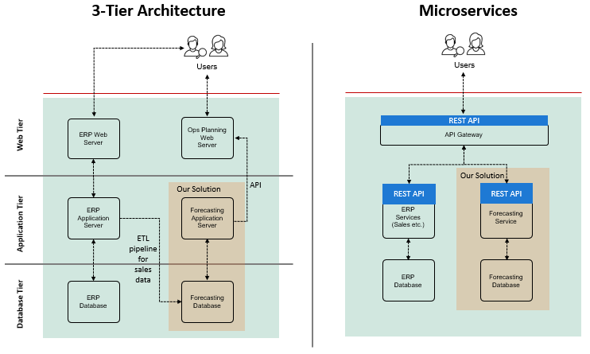
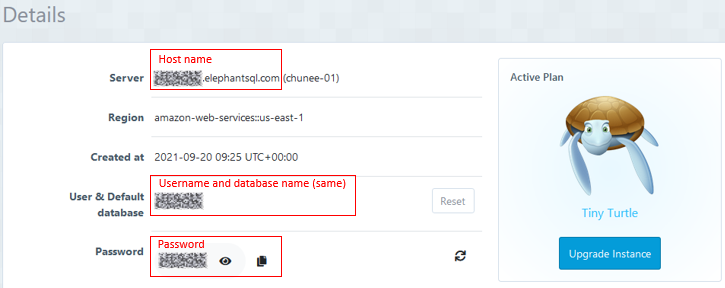
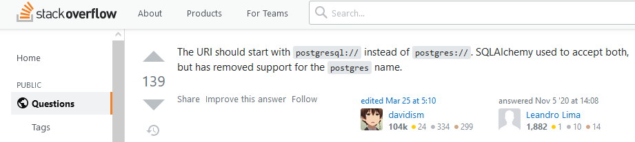

# Deploying Our Time Series Forecasting Model - Milestone 1

This Markdown serves as a guided workflow to Milestone 1 of the liveProject on Deploying Our Time Series Forecasting Model.
The liveProject is the third and last part of a series titled "End-to-end Time Series Forecasting with Deep Learning".

In this liveProject, you are a data scientist at a large retailer and your challenge is to forecast the sales of the respective stores by each category for the next 28 days.



Our aim in this Milestone is to architect our solution for Production deployment. In previous liveProjects, we have been using Jupyter notebooks and CSV files for our development work. While Jupyter notebooks and CSV files are great for experimentation, we need our code in scripts and data in databases for Production deployment. We shall understand how we can structure our code repository for easier code maintenance, as well as reading and writing our data to PostgreSQL for a secured and scalable solution. 

<br>

---------------------------------------------

## Installing Necessary Libraries

We have provided a requirements.txt file in the root folder. Please create a Python virtual environment using [virtualenv](https://realpython.com/python-virtual-environments-a-primer/) or [Conda](https://conda.io/projects/conda/en/latest/user-guide/tasks/manage-environments.html#creating-an-environment-with-commands) and install the necessary libraries using [pip and the requirements.txt file](https://note.nkmk.me/en/python-pip-install-requirements/).

<ins>Instructions</ins>:<br>
- Create a virtual Python environment

- Install necessary libraries using pip and *requirements.txt*

<br>

---------------------------------------------

## Overview of our Solution Architecture

Before we dive straight into the exercises, let's take a while to have a high level overview of our forecasting solution and how it may fit in with the other applications in the organization.



Typically, applications may be structured in the form of a traditional three-tier architecture (above diagram left) or more modern microservices (above diagram right).

Regardless of which architecture our solution (in red box) may be in, the diagram above shows a very simplified way of how our solution fits in with the rest of the organization's applications. In general, our solution may need to extract sales data from the [Enterprise Resource Planning (ERP)](https://en.wikipedia.org/wiki/Enterprise_resource_planning) system, transform it and then load it into our Forecasting database. The Forecasting database is also where we will store our predictions and other model statistics. The Forecasting application server or service stores our scripts and performs model training, prediction and evaluation on a scheduled or ad-hoc basis. To serve our model predictions, our Forecasting application has a [REST API](https://www.smashingmagazine.com/2018/01/understanding-using-rest-api/) for other applications (e.g., operations planning) to connect to and consume. In our next Milestone, we shall take a closer look at what is a REST API, why REST API and how we can create one with FastAPI. For our current Milestone, having appreciated how our solution fits into the overall picture, we shall now zoom into our codebase and database structure.

<br>

---------------------------------------------

## Our Database

Most likely, as a data scientist, you are not required to set up and configure a database; your organization probably has data engineers to do that and ensure the database security and performance. We are also not going into details of a database setup here. Rather, our objective is to appreciate how our solution can read from and write data into a database. As mentioned earlier, CSVs are great for development work but are not suitable for Production use. Besides security issues, it will not be scalable using CSVs. Hence, in this section, we shall perform the following:
1. Create a PostgreSQL database
2. Populate the relevant tables with initial data for us to subsequently work with

<br>

### Creating our PostgreSQL database

<ins>Instructions</ins>:<br>
* Create a PostgreSQL database. 

* Obtain the database name, username, password and host name.

<ins>Hints</ins>:<br>
* As our objective is not to go into details of database setup and configuration, we would recommend you to create a PostgreSQL database using the free Tiny Turtle plan of [ElephantSQL](https://www.elephantsql.com/docs/). After you have setup a database on ElephantSQL, refer to the screenshot below to get the relevant parameters. <br>

* If you would like to install PostgreSQL in your local environment, please follow the relevant guide here.
    * Windows - https://phoenixnap.com/kb/install-postgresql-windows
    * Mac - https://www.sqlshack.com/setting-up-a-postgresql-database-on-mac/
    * Ubuntu - https://phoenixnap.com/kb/how-to-install-postgresql-on-ubuntu

* For the more adventurous and advanced users, you can also [setup PostgreSQL database with Docker](https://dev.to/andre347/how-to-easily-create-a-postgres-database-in-docker-4moj).

<br>

### Populate relevant tables

Our database is a simple one with two tables:
| Table       | Description                                                                                     |
|-------------|-------------------------------------------------------------------------------------------------|
| sale_clean  | Contains the cleaned sales data that are extracted from ERP system, transformed and loaded here |
| prediction  | Stores our model predictions                                                                    |

To facilitate the exercise, we have created a Python script to create and populate the necessary tables. 

The most important table *sale_clean* contains data modified from the first liveProject. Note that there are 5 columns with ~54k rows. The daily sales (column: `sales`) for each store (column: `store_id`) and category (column: `cat_id`) are listed in each row. Altogether, there are 10 stores and 3 categories. The column `in_training` is a boolean indicating whether the data point is in our training sample and will be useful in the last Milestone.

<ins>Instructions</ins>:<br>
* Fill in your database parameters in the script *src/setup_db.py*.

* In your terminal, change directory to the *src* folder and execute `python setup_db.py`.

* Preview the tables for general understanding. You should have all tables created and data populated.

<br>

---------------------------------------------

## Our Codebase

To ensure our codebase is easily maintainable, we should at least have the following:
* Organized repository with files in well-structured folders
* Modular code for readability and easy debugging
* Configuration file for convenient settings management

An overview of our codebase structure is as follows:
```
|---README_Milestone1.md
|---README_Milestone2.md
|---README_Milestone3.md   
+---config
|   \---config.ini     
+---data   
+---img
+---logs    
+---model                    
+---notebook    
\---src
    |---api.py
    |---DataProcessor.py
    |---Model.py    
    |---eval.py
    |---predict.py
    |---train.py
    +---utils
        |---compute_metrics.py
        \---extract_config.py
```

| Folder/File          | Description                                                                                                                                                                                                                                                                                                |
|----------------------|------------------------------------------------------------------------------------------------------------------------------------------------------------------------------------------------------------------------------------------------------------------------------------------------------------|
| README            | In our case, we have a README file for each Milestone. A README communicates important information about your project. Read this [GitHub Docs](https://docs.github.com/en/repositories/managing-your-repositorys-settings-and-features/customizing-your-repository/about-readmes) for more information. |
| config               | Contains our config.ini file to house all our configurations, making change of settings easy.                                                                                                                                                                                                              |
| data                 | If we have any source or intermediate data files, we can save it here before populating it to the database.                                                                                                                                                                                                |
| img                  | Images for our documentation are stored here.                                                                                                                                                                                                                                                              |
| logs                 | Contains logfiles for our debugging purposes.                                                                                                                                                                                                                                                              |
| model                | Model files are saved here.                                                                                                                                                                                                                                                                                |
| notebook             | Our notebooks from our development work can be placed here for future reference.                                                                                                                                                                                                                           |
| src                  | Our scripts are stored in src folder                                                                                                                                                                                                                                                                       |
| src/api.py           | We will work on this file in Milestone 2. This file contains our code for creating REST API.                                                                                                                                                                                                               |
| src/DataProcessor.py | Contains a DataProcessor class to handle all data reading, writing and processing.                                                                                                                                                                                                                         |
| src/Model.py         | NBeatsModel class is responsible for all model training and prediction.                                                                                                                                                                                                                                    |
| src/eval.py          | Performs evaluation of model predictions against actuals                                                                                                                                                                                                                                                   |
| src/predict.py       | Execute the prediction pipeline by reading in the cleaned sales data, pass it to model and write predictions to database.                                                                                                                                                                                  |
| src/train.py         | Trains and optimize the model using latest cleaned sales data.                                                                                                                                                                                                                                             |
| src/utils            | Contains helper functions that can be reused in multiple scripts.                                                                                                                                                                                                                                          |

<ins>Instructions</ins>:<br>
* Complete the function `configfile` in *src/utils/extract_config.py* and test your completed function by running the script to ensure it works.

* `ConfigParser` returns all parameters from our *config.ini* file in the form of strings. However, some of our parameters are supposed to be integers, floats, or even lists and dictionaries. We can easily obtain integers by, for example, using `int(configfile.get('model', 'prediction_length'))`. Using similar concept, complete lines 40 to 47 of *src/Model.py* to ensure that the parameters retrieved are converted to the correct form.

* Fill in the `database_url` parameter in *config/config.ini* and complete the methods `read_from_db` and `write_to_db` in *src/DataProcessor.py* to enable the reading and writing of data to the database we have set up.

* Most of the code has been completed for you as they were inherited from the notebooks from previous Milestones. We have taken the codes from the Jupyter notebooks and put them in scripts in a modular way. Earlier, we have walked you through the codebase from a high level perspective. Your task is to complete the script *src/predict.py* that will read in the sales data, pass it to the model to get the predictions, and finally write the model predictions to the database. Hopefully, you will find this task easy since the code has been modularized. Test your completed *src/predict.py* script by running it before moving on.

<ins>Hints</ins>:<br>
* [You can refer to here for documentation for ConfigParser](https://docs.python.org/3/library/configparser.html)

* [Possible way to convert string to correct format](https://www.kite.com/python/docs/ast.literal_eval)

* [Pandas documentation on reading from database](https://pandas.pydata.org/pandas-docs/stable/reference/api/pandas.read_sql.html)

* [Pandas documentation on writing to database](https://pandas.pydata.org/pandas-docs/stable/reference/api/pandas.DataFrame.to_sql.html)

* If you experienced the error `sqlalchemy.exc.NoSuchModuleError` when testing your *src/predict.py* script, you may wish to refer to this [stackoverflow post](https://stackoverflow.com/questions/62688256/sqlalchemy-exc-nosuchmoduleerror-cant-load-plugin-sqlalchemy-dialectspostgre) for solution.

    

<br>

---------------------------------------------

## Conclusion

Having familiarized ourselves with the codebase and database, we have completed Milestone 1. Excellent job!

Do compare your code with our solution before moving on to our next Milestone :)